# PowerApps Portfolio
Collection of all apps I have designed and built using PowerApps and SharePoint.
1. [OnePMO Canvas](#onepmo-canvas)
2. [Engineering Dashboard](#engineering-dashboard)
3. [Knowledge Management Tool](#knowledge-management-tool)
4. [IDEAS Portal](#ideas-portal)
5. [Hoilday Tracker](#holiday-tracker)
6. [WOW Checklist](#wow-checklist)
7. [Learning & Development Dashboard](#learning-and-development-dashboard)
8. [Vendor Dashboard](#vendor-dashboard)
9. [IPT Maintenance](#ipt-maintenance)
10. [B+S Escalation Dashboard](b+s-escalation-dashboard)
11. [Shipping Dashboard](#shipping-dashboard)

Custom Built Functions
1. [Approval Cycle](#approval-cycle)
2. [User Defaults](#user-defaults)
3. [Custom Data Collection](#custom-data-collection)
4. [Dynamic Emails](#dynamic-emails)

## Apps
### OnePMO Canvas
Project management tool for the engineering department.

  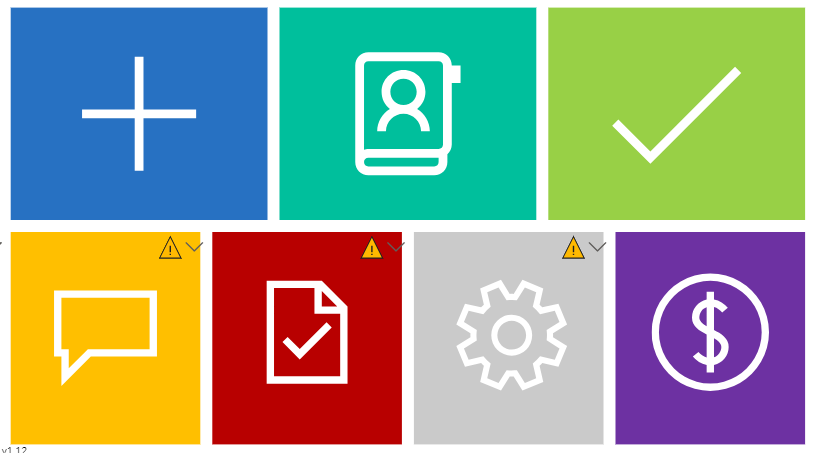

Custom functions built using PowerApps and Sharepoint.

  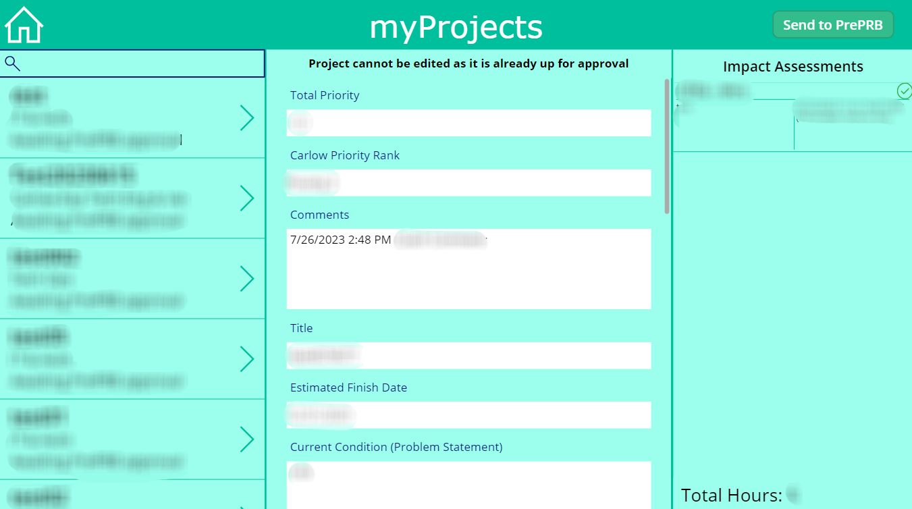

Includes multiple approval and review cycle functions and email flows.

  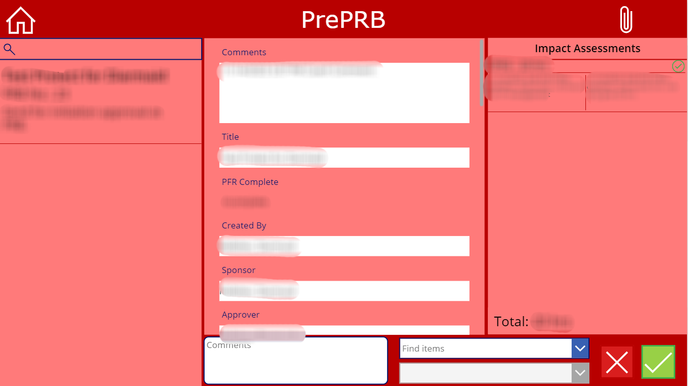

  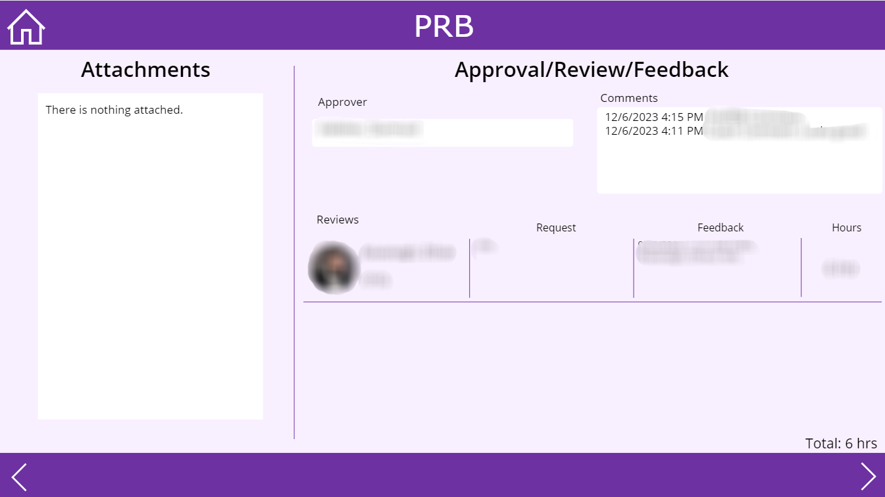

Integration with external PMO applications using Power Automate

  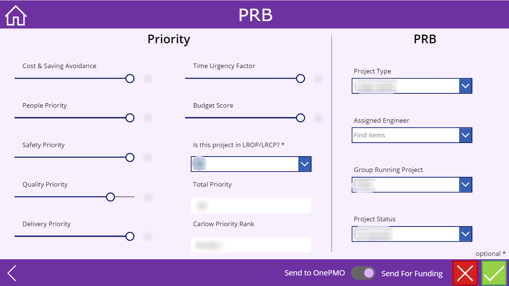

### Engineering Dashboard
Dashboard containing all relevant information for the engineering department. This includes useful links and a number of tools for tracking progress and retrieving updates from the team, tracking office attendance. The dashboard also directly integrates with the Annual Leave Dashboard.

  

  

### Knowledge Management Tool
Tool for documenting and aggregating all information onsite.

  

 
Functions to allow custom data to be collected.

  

Functions to collect ‘default’ information for individual users and departments/subgroups.

  

### IDEAS Portal

  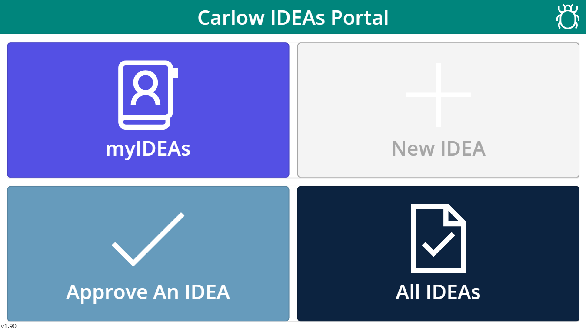

  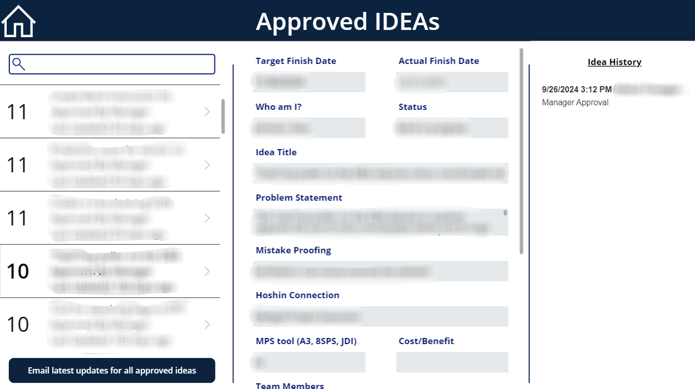

### Holiday Tracker
Basic app to allow users to book annual leave.

  

Can see all team's annual leave.

  

Approval cycle with the manager for requests.

  

The project was replicated across other departments.

### WOW Checklist
The dashboard is used to make acknowledgements of good practice and positive behaviour across all departments on site.

  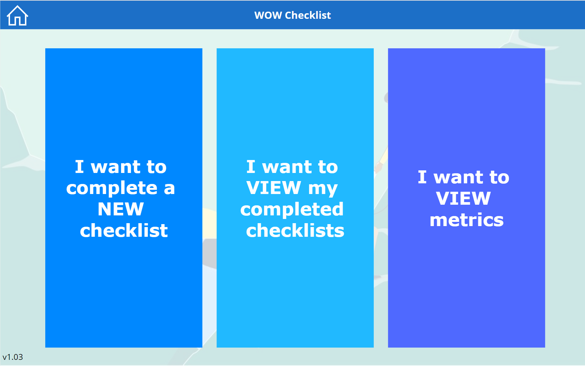

  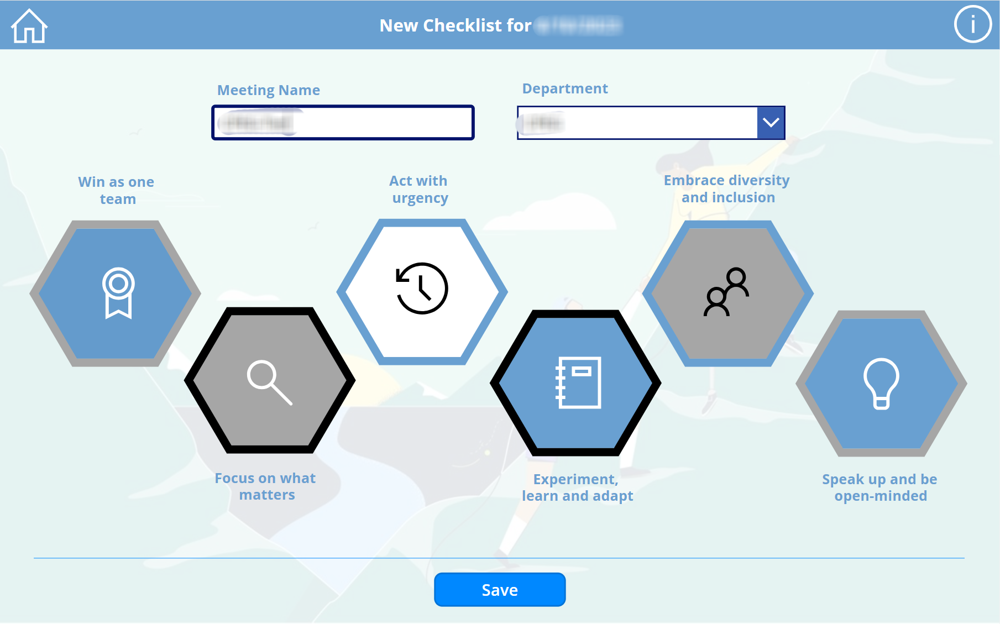

### Learning And Development Dashboard
Tool for administering learning and development curriculum. Email flow to bridge the gap between admins and users. Cut down the amount of back and forth in the early stages of the process.

  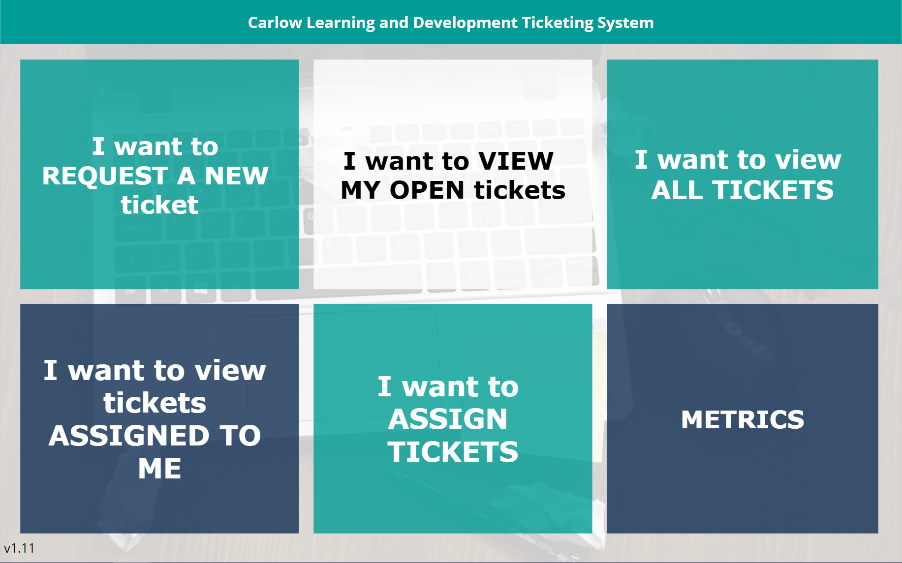

  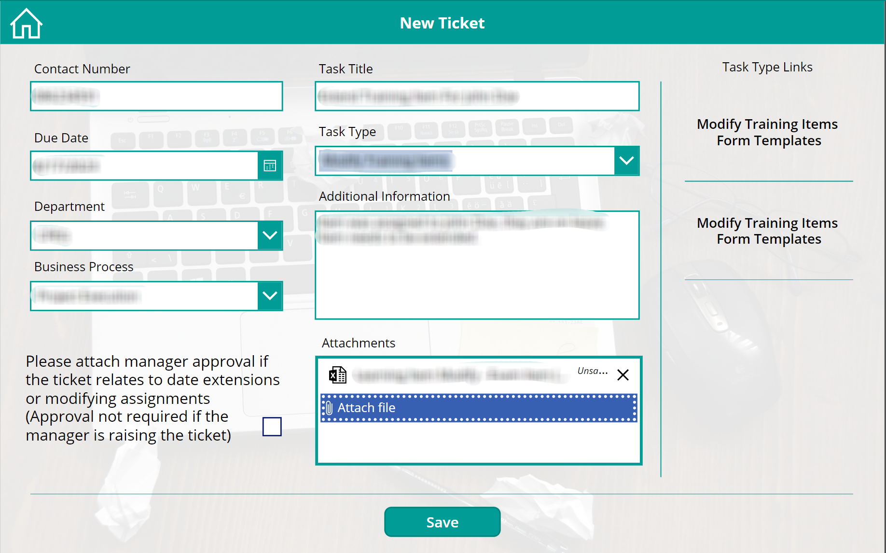

Function to allow delegation of tickets.

  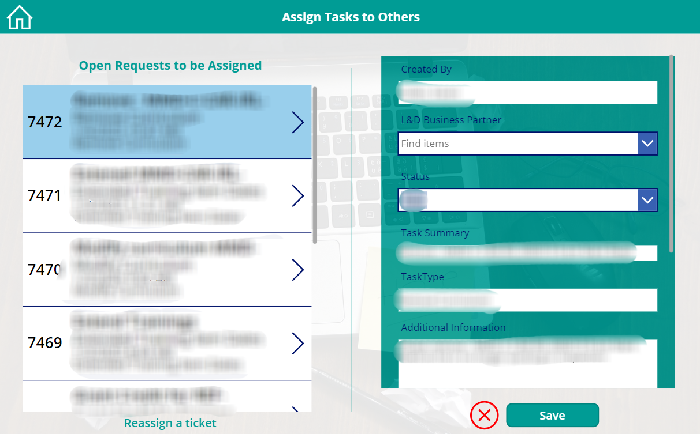

Basic metrics to track progress.

  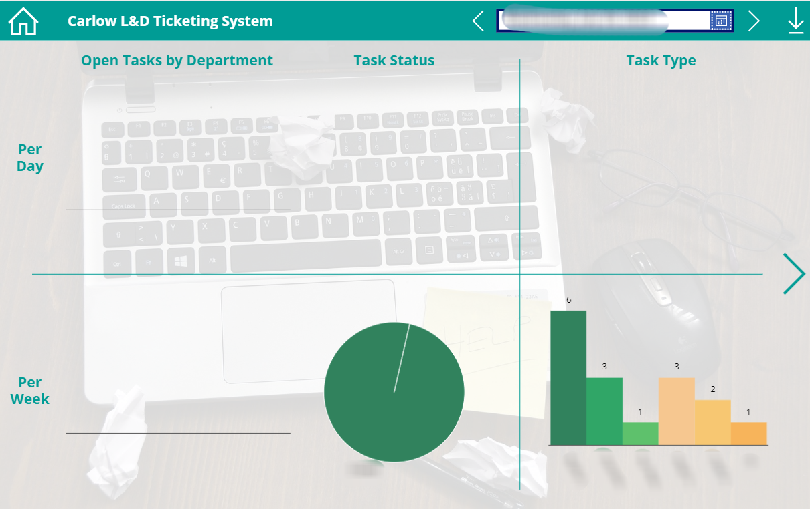

### Vendor Dashboard
Dashboard to collect and track meeting notes and projects involving external vendors.

  

  

### IPT Maintenance
Dashboard to collect and track meeting notes and updates from those working on production lines.

  

  

### B+S Escalation Dashboard
Dashboard to directly interact with external vendor B+S.

  

  

### Shipping Dashboard
Dashboard for tracking stock of storage warehouse, who is taking out and putting in.

  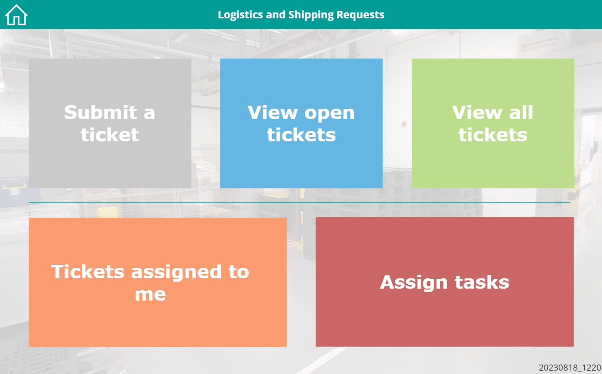

  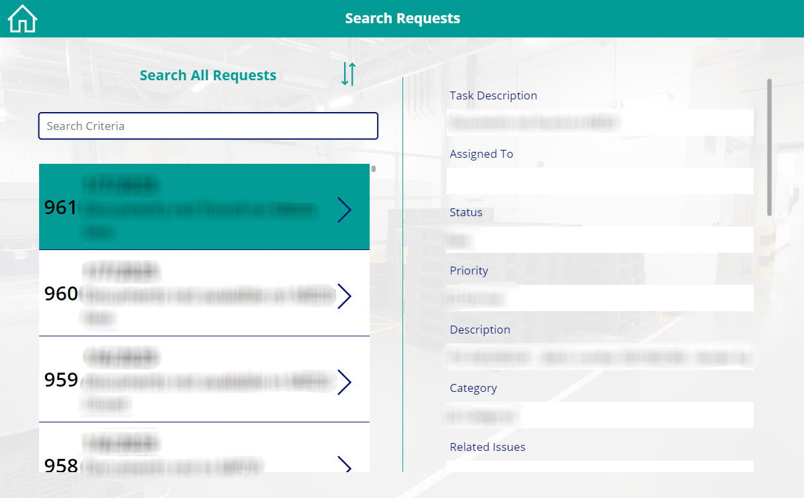

## Custom Built Functions

### Approval Cycle
### User Defaults
### Custom Data Collection
### Dynamic Emails
