# PowerApps Portfolio
Collection of all apps I have designed and built using PowerApps and SharePoint.

1. [OnePMO Canvas](#onepmo-canvas)
2. [Engineering Dashboard](#engineering-dashboard)
3. [Knowledge Management Tool](#knowledge-management-tool)
4. [IDEAS Portal](#ideas-portal)
5. [Hoilday Tracker](#holiday-tracker)
6. [WOW Checklist](#wow-checklist)
7. [Learning & Development Dashboard](#learning-and-development-dashboard)
8. [Vendor Dashboard](#vendor-dashboard)
9. [IPT Maintenance](#ipt-maintenance)
10. [B+S Escalation Dashboard](b+s-escalation-dashboard)
11. [Shipping Dashboard](#shipping-dashboard)
12. [Weigh & Dispense Dashboard](#weigh-and-dispense-dashboard)
13. [In Office Tracker](#in-office-tracker)

## OnePMO Canvas
- Project management tool for the engineering department.
- Includes multiple approval and review cycle functions and email flows.
- Custom function built using powerapps and sharepoint.

## Engineering Dashboard

  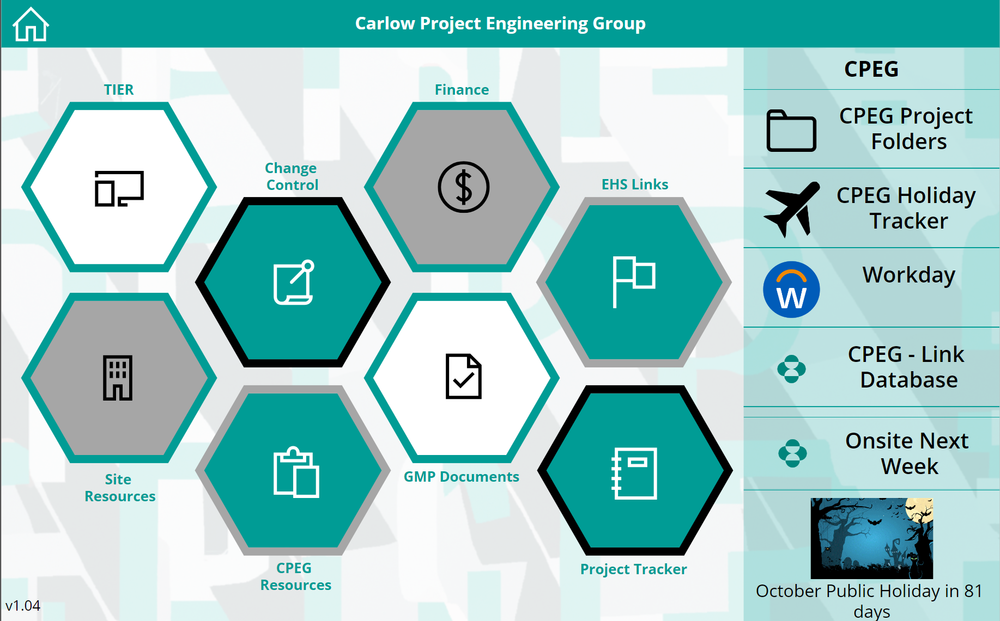

 
Functions to allow custom data to be collected.

  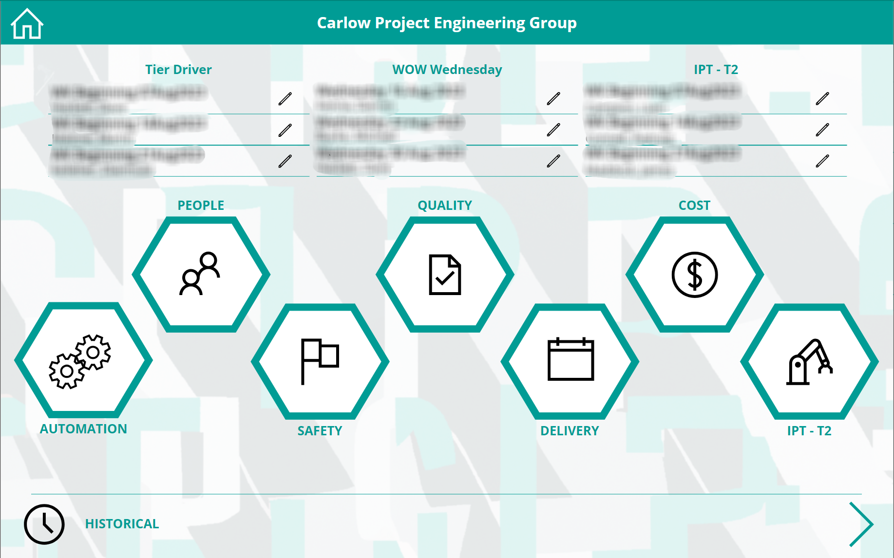

## Knowledge Management Tool
Tool for documenting and aggregating all information onsite.

  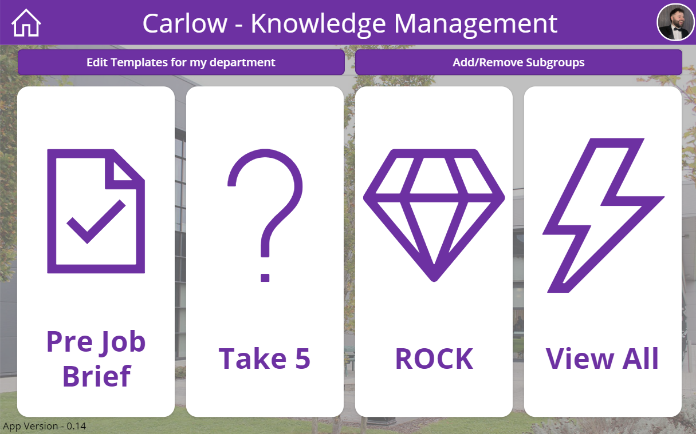

 
Functions to allow custom data to be collected.

  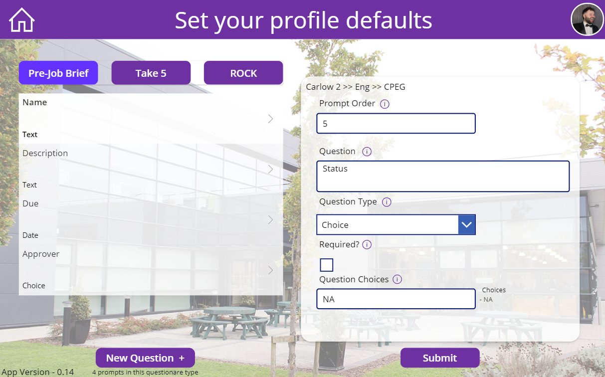

Functions to collect ‘default’ information for individual users and departments/subgroups.

  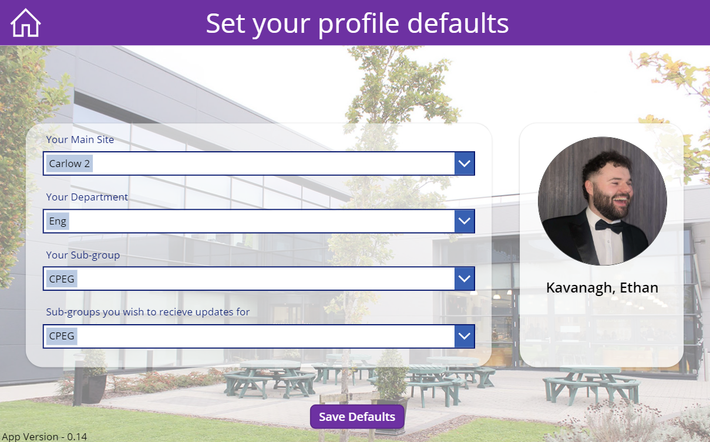

## IDEAS Portal
IDEAS Portal

## Holiday Tracker
Basic app to allow users to book annual leave.

  

Can see all teams annual leave.

  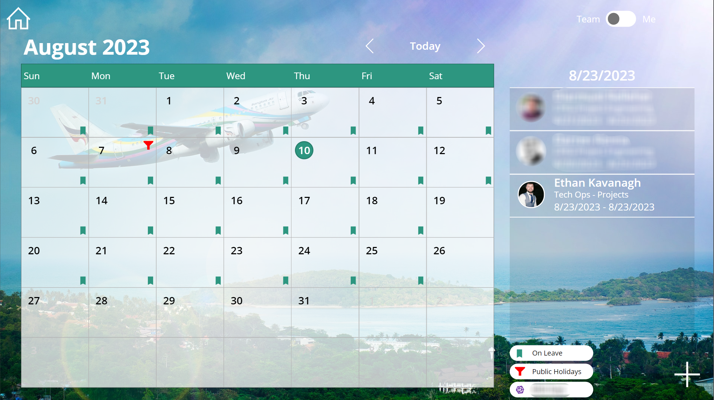

Approval cycle with manager for requests.

  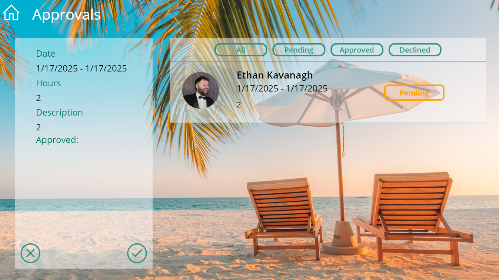

## WOW Checklist
WOW Checklist

## Learning And Development Dashboard
- Tool for administering learning and development curriculum.
- Function to allow delegation of tickets.
- Email flow to bridge gap between admins and users
- Basic metrics to track progress.

## Vendor Dashboard

  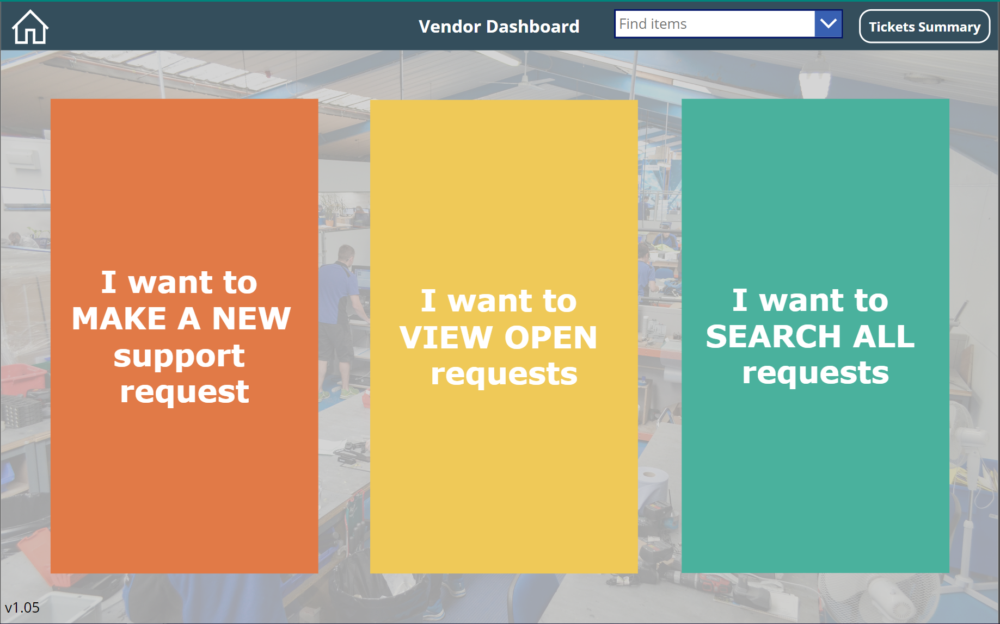

  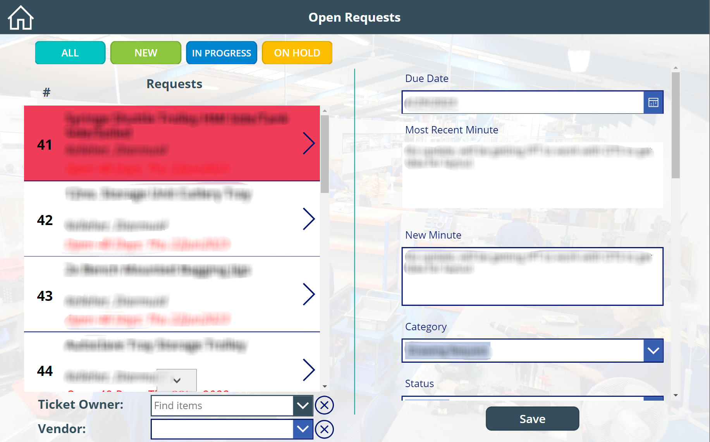

## IPT Maintenance

  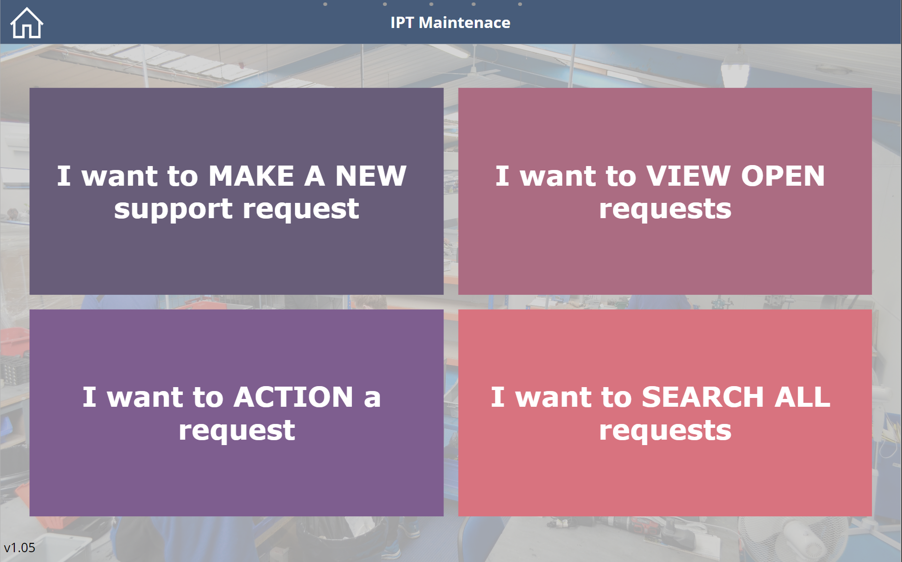

  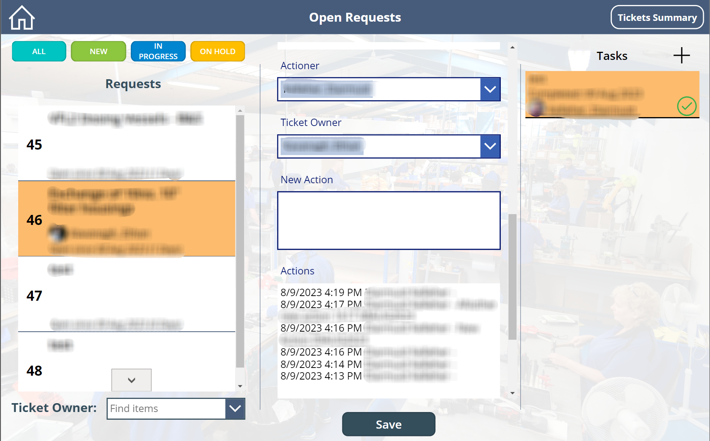

## B+S Escalation Dashboard

  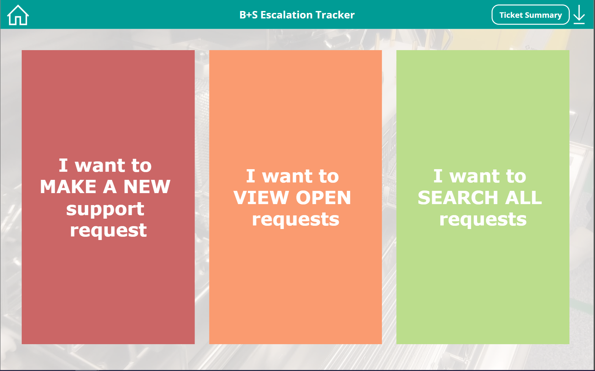

  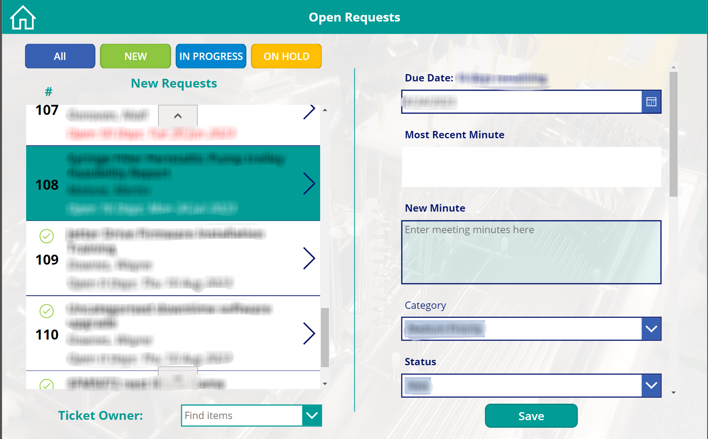

## Shipping Dashboard
Shipping Dashboard

## Weigh And Dispense Dashboard
W&D Dashboard

## In Office Tracker
In Office Tracker
